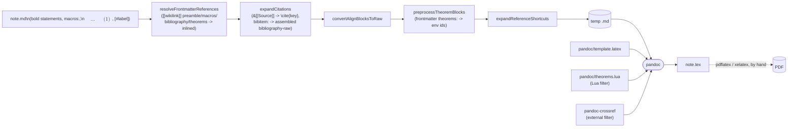
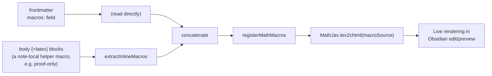
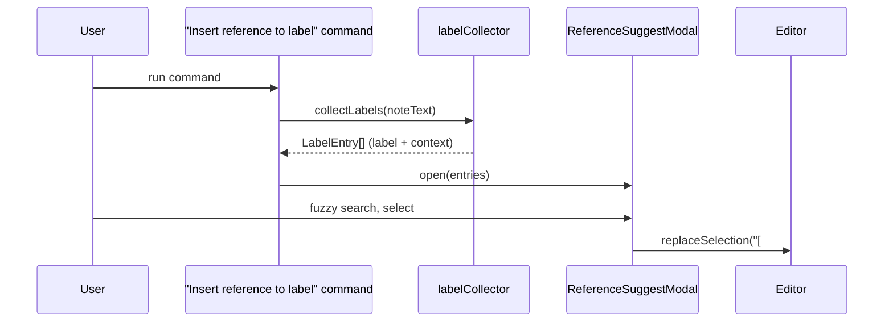

# Architecture

LavaTex is split into two independent concerns that don't know about each
other: turning a note into a `.tex` file (**export**), and making custom
math commands render live while you write (**preview**). A third, smaller
piece collects labels for the reference-picker command. All of the actual
"understand LaTeX" work is delegated to `pandoc`, `pandoc-crossref`, and a
small Lua filter — LavaTex's own code is pure text transforms plus some
Obsidian glue.

## Source layout

```
latex-exporter/src/
  latex/                        pure functions, no Obsidian API
    theoremEnvironments.ts        frontmatter -> {trigger word: env id}
    theoremBlockPreprocessor.ts   bold-statement block -> pandoc fenced div
    rawEnvironments.ts            $$\begin{align}...\end{align}$$ -> {=latex} raw block
    referenceShortcuts.ts         [#label] -> raw \ref{label} span
    inlineMacros.ts                \newcommand in body {=latex} blocks -> text
    labelCollector.ts             note text -> every {#label} + context
  obsidian-math/
    mathJaxMacros.ts             feed macro text to Obsidian's live MathJax renderer
  export/
    paths.ts                     vault/plugin filesystem paths
    pathEnv.ts                   PATH augmentation shared by pandoc.ts/latex.ts
    frontmatterRefs.ts           resolve [[wikilink]] frontmatter fields to referenced notes
    citations.ts                 &[[Source]] -> raw \cite{key} span + assembled bibliography-raw
    pandoc.ts                    spawn pandoc with the fixed flag set
    latex.ts                     spawn latexmk to compile PDF, open it
    exporter.ts                  orchestrates the preprocessing passes + pandoc(+pdf)
  ui/
    ReferenceSuggestModal.ts     fuzzy picker for "Insert reference to label"
    RawLatexModal.ts             prompt for a raw LaTeX snippet to insert
  main.ts                        wires commands + events to the pieces above
```

Everything in `latex/` is text-in/data-out with no side effects, which is
what makes each transform independently testable and lets `exporter.ts` stay
a short, readable pipeline instead of a place where unrelated concerns pile
up.

## Export: note → `.tex`



Each preprocessing step targets disjoint syntax (align blocks, bold headers,
reference shortcuts), so their order mostly doesn't matter — they're run in
this sequence in `exporter.ts` for no reason deeper than readability.

`theorems.lua` is the one piece doing real LaTeX-environment work
(`::: {.lemma title="..." #id}` → `\begin{lemma}[...]\label{id}`);
`theoremBlockPreprocessor.ts`'s only job is producing the fenced-div syntax
that filter understands. Two small single-purpose transforms instead of one
that does both jobs.

Pandoc never reparses a fenced div's attribute values as markdown — they're
plain strings — so a title containing a raw-inline span (like a citation's
`` `\cite{key}`{=latex} ``) would otherwise land in the `.tex` literally,
backticks and all. `theorems.lua` round-trips the title string through
`pandoc.read`/`pandoc.write` before splicing it into `\begin{env}[title]`,
so it's rendered exactly like ordinary body text would be.

Numbered, cross-referenceable equations (`$$...$$ {#eq:foo}`, `[@eq:foo]`)
are handled entirely by `pandoc-crossref` — a well-maintained, purpose-built
tool for exactly that, not reimplemented here.

## Live preview: math macros in Obsidian's own editor

Obsidian's MathJax renderer has no idea what a note's custom `\newcommand`s
mean — normally it only ever sees them inside the exported `.tex`, compiled
by real LaTeX. LavaTex mirrors macro definitions into MathJax's own live
macro table so they render immediately in edit/preview mode too:



This runs on plugin load and whenever the active note or its frontmatter
changes (`main.ts` listens to `workspace.on("active-leaf-change")` and
`metadataCache.on("changed")`).

The registration technique matters and was the result of an actual bug:
mutating `MathJax.tex.macros` directly is a dead end — that object is only
consulted once, at MathJax's own startup, so changing it afterwards is a
silent no-op. Running the macro text through MathJax's own parser via
`tex2chtml` is what actually works, because `\newcommand` execution is a
real side effect of that parse. This is the same technique the community
[Extended MathJax](https://github.com/wei2912/obsidian-latex) plugin uses
for its preamble.sty feature.

Not every macro can render this way: `\pa` in the worked example uses
`\rotatebox` (a `graphicx` package macro), which MathJax's TeX engine simply
doesn't implement — no such extension exists for MathJax. It renders
correctly in the exported PDF (real LaTeX) but shows as an undefined-command
error in Obsidian's preview. Accepted, on purpose: LavaTex's preview stays
MathJax-only rather than shelling out to a local LaTeX install to render one
symbol.

## Inserting a reference



`collectLabels` scans for every `{#label}` attribute in the note — a
bold-statement theorem header and a labelled `$$...$$ {#eq:foo}` equation
use the identical syntax, so one scan finds both kinds, and the picker
doesn't need to know which is which.
