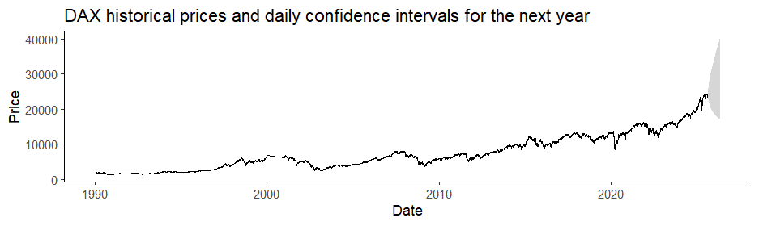
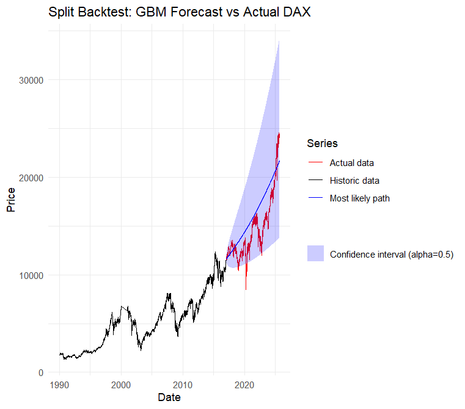
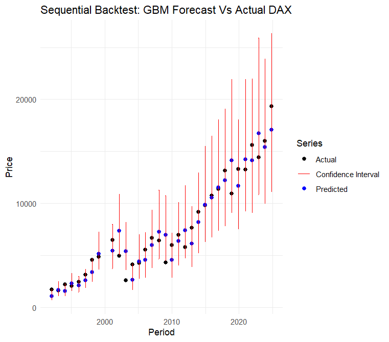
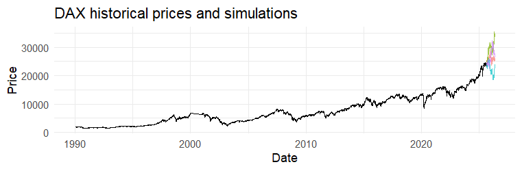
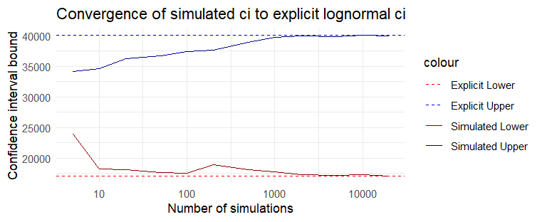

# Anwendungen auf Zeitreihen

## Kalibrierung
Aus einem Datensatz lassen sich die Parameter $\mu$ und $\sigma$ der
geometrischen Brownschen Bewegung schätzen.
Für reale Werte ist $\Delta t > 0$ und $n$ ist die Anzahl von Datenpunkten.
Zur Schätzung von $\mu$ und $\sigma$ werden die (unabhängigen) log-Rendite
$$r_j := \log S_j - \log S_{j-1}= \big(\mu - \tfrac12 \sigma^2\big)\Delta t + \sigma (W_j - W_{j-1})$$
genutzt. Da $W_j - W_{j-1} \sim \mathcal N(0, \Delta t)$ folgt
$$r_j \sim \mathcal N((\mu - \tfrac12 \sigma^2)\Delta t, \sqrt{\sigma} \Delta t).$$
Man berechnet also die log-Rendite $\hat r_j$ des Datensatzes,
und davon den empirischen Erwartungswert $m$ (den Durchschnitt) und die empirische Varianz $s^2$.
Dann folgt $$\sigma \approx s,\quad \mu \approx m + \frac{1}{2} s^2.$$
Die Schätzung der Parameter kann in R wie folgt durchgeführt werden:

```r
log_returns <- diff(log(dax$Price)) # tägliche Werte
sigma <- sd(log_returns)
mu <- mean(log_returns) + 0.5 * sigma^2
```

## Bootstrap-Verfahren zur Kalibrierung
Das Bootstrap-Verfahren ermöglicht eine probabilistische Schätzung der Parameter $\mu$ und $\sigma$.
Durch wiederholte Auswahl (Sampling) von Teildaten und Schätzung der Parameter,
wobei die verschiedenen Schätzungen anschließend verglichen werden kann man Konfidenzintervalle für $\mu$ und $\sigma$ erzeugen.
Wenn sich die Parameterschätzungen stark unterscheiden (z. B. durch geringe oder gestörte Datenbasis), so sind die Konfidenzintervall breiter.
Es folgt eine Implementierung in R:

```r
log_returns <- diff(log(dax$Price))
boot_res <- replicate(1000, {
  sample_ret <- sample(log_returns, length(log_returns) / 2, replace = TRUE)
  c(mu = mean(sample_ret) * 252 - 0.5 * (sd(sample_ret) * sqrt(252)) ^ 2,
    sigma = sd(sample_ret) * sqrt(252))
})

boot_df <- as.data.frame(t(boot_res))
mu_ci <- quantile(boot_df$mu, c(0.025, 0.975))
sigma_ci <- quantile(boot_df$sigma, c(0.025, 0.975))
```

Die Bootstrap-Methode liefert für die DAX-Daten zum 5\%-Niveau:
$$\mu = 0.051 \in [-0.055, 0.148], \quad \sigma = 0.218 \in [0.212, 0.225].$$

## Berechnung von Konfidenzintervallen für künftige Werte

Da $S_T$ log-normalverteilt ist, reicht es ein Konfidenzintervall für die
logarithmische Normalverteilung zu berechnen.
Sei $X \sim \mathcal N(\mu, \sigma^2)$ eine normalverteilte Zufallsvariable.
Dann ist $Y := e^X$ log-normalverteilt mit Parametern $\mu$ und $\sigma^2$.
Ein zweiseitiges Konfidenzintervall für $X$ mit Konfidenzniveau $1-\alpha$ ist
$$[\mu - z_{\alpha/2} \sigma, \mu + z_{\alpha/2} \sigma],$$
wobei $z_{\alpha/2}$ das $(1-\alpha/2)$-Quantil der Standardnormalverteilung ist.
Exponentiell transformiert ergibt sich das Konfidenzintervall für $Y$:
$$[e^{\mu - z_{\alpha/2} \sigma}, e^{\mu + z_{\alpha/2} \sigma}].$$

**Beispiel** (Konfidenzintervall für den DAX)

Im folgenden R-Programm (Ausschnitt) wird ein 95\%-Konfidenzintervall für den DAX in einem Jahr von heute (252 Handelstage) berechnet.
Dazu werden die Parameter $\mu$ und $\sigma$ wie oben aus den täglichen log-Renditen geschätzt.

```r
alpha = 0.05
T <- 252
z <- qnorm(c(1 - alpha/2, alpha/2))
ci <- S0 * exp((mu - 0.5 * sigma^2) * T + z * sigma * sqrt(T))
```

Hier ist $S_0$ der heutige Kurswert des DAX. Das Konfidenzintervall lautet in diesem Fall:
$$[17217, 40097].$$
∎

**Beispiel** (Konfidenzband für den DAX)

Im folgenden R-Programm (Ausschnitt) wird ein 95\%-Konfidenzband für den DAX im naechsten Jahr (252 Handelstage) berechnet.

```r
alpha = 0.05
n <- 252
last_date <- max(dax$Date)
future_dates <- last_date + 1:n

q_low <- S0 * exp((mu - 0.5 * sigma^2) * (1:n) + qnorm(1 - alpha/2) * sigma * sqrt((1:n)))
q_hi  <- S0 * exp((mu - 0.5 * sigma^2) * (1:n) + qnorm(alpha/2) * sigma * sqrt((1:n)))
q_med <- S0 * exp((mu - 0.5 * sigma^2) * (1:n))

band <- data.frame(Date = future_dates, low = q_low, mid = q_med, hi = q_hi)
```

Es folgt eine Visualisierung des Konfidenzbandes im Anschluss an die historischen Daten.
∎

{#fig:dax_confidence_band}

## Back-Tests

Ein Backtest überprüft im Nachhinein, wie gut ein Modell mit historisch tatsächlich
verfügbaren Daten funktioniert hätte.

**Beispiel** (Back-Test der Kalibrierung auf den DAX)
Im Fall der DAX-Zeitreihe werden die Parameter $\mu$ und $\sigma$ auf die Daten von 1990 bis 2008 geschätzt.
Nun wird ein Backtest durchgeführt, indem die Parameter genutzt werden, um die DAX-Entwicklung von 2008 bis 2025 zu simulieren. Insgesamt
wird also ein 50/50-Mix aus historischen Daten und simulierten Daten betrachtet. Außerdem
werden Konfidenzintervalle zum Niveau 50\% berechnet. Die folgende Abbildung
[#fig:dax_backtest] zeigt die Ergebnisse.

In diesem Fall fallen 86\% der historischen Daten in das 50\%-Konfidenzintervall,
was für die Einfachheit des Modells ein gutes Ergebnis ist. Diese Metrik nennt
man \textit{Überdeckungswahrscheinlichkeit}.
∎

{#fig:dax_backtest}

**Bemerkung** (Weitere Metriken für Zeitreihenschätzungen)
Botchkarev &[[Botchkarev]] nennt u. a. folgende Metriken, um die Richtigkeit von Vorhersagen zu bewerten:

- Mean Squared Error (MSE): $$\text{MSE} = \frac{1}{n} \sum_{i=1}^n (y_i - \hat{y}_i)^2$$
- Normalized Root Mean Squared Error (NRMSE) : $$\text{NRMSE} = \frac{\sqrt{\text{MSE}}}{y_{max} - y_{min}}$$
- Mean Absolute Percentage Error (MAPE): $$\text{MAPE} = \frac{100\%}{n} \sum_{i=1}^n \left|\frac{y_i - \hat{y}_i}{y_i}\right|$$

Hierbei sind $y_i$ die tatsächlichen Werte und $\hat{y}_i$ die vorhergesagten Werte.
Der MSE misst den durchschnittlichen quadratischen Fehler, der bei großen Werten der Zeitreihe schwer
zu interpretieren ist. Der NRMSE normiert den MSE auf den Bereich der Zeitreihe,
wodurch er vergleichbarer wird. Der MAPE gibt den durchschnittlichen prozentualen Fehler an, und ist
somit ebenfalls anschaulich interpretierbar.
∎

**Beispiel** (Metriken des DAX-Backtests)
Im obigen Backtest des DAX ergeben sich folgende Metriken:

| Metrik | Wert | Einheit |
|---|---|---|
| MSE | 3489387 | Punkte² |
| MAPE | 13.91685 | \% |
| NRMSE | 0.1659164 | - |

Table: Fehlermaße der Prognose {#tbl:metrics}

∎

**Beispiel** (Sequenzieller Backtest)
Man kann Backtests auch sequenziell durchführen: Für jedes Jahr wird aus den vorherigen Jahren eine GBM kalibriert, die dann mit dem tatsächlichen Wert verglichen wird. Dies wird in Abbildung [#fig:dax_backtest_seq] gezeigt.
∎

{#fig:dax_backtest_seq}

## Monte-Carlo-Simulation

Genauso wie man eine Brownsche Bewegung mit summierten Normalverteilungen simuliert,
wird eine geometrische Brownsche Bewegung durch exponentiell transformierte
summierte Normalverteilungen simuliert.

**Beispiel** (Monte-Carlo-Simulation des DAX)
Theoretisch liegt das stetige Modell zugrunde,
aber in der Praxis wird eine diskrete Approximation verwendet, hier mit täglichen Schritten.
Der folgende R-Code (Ausschnitt) simuliert 1000 Pfade der geometrischen Brownschen Bewegung
mit den oben geschätzten Parametern $\mu$ und $\sigma$ für den DAX, wieder für das nächste Jahr (252 Handelstage).

```r
n <- 252
paths <- 1000
S0 <- tail(dax$Price, 1)

simulations <- replicate(paths, {
  W <- c(0, cumsum(rnorm(n, 0, 1)))
  S0 * exp((mu - 0.5 * sigma^2) *  c(0, (1:n)) + sigma * W)
})
```
Es folgt eine Visualisierung der Simulation im Anschluss an die historischen Daten (Abbildung [#fig:dax_monte_carlo]).
∎

{#fig:dax_monte_carlo}

**Beispiel** (Vergleich von Konfidenzintervall und Monte-Carlo-Simulation)

Man kann das Konfidenzintervall aus dem vorherigen Beispiel mit den Quantilen der Monte-Carlo-Simulation vergleichen.
Man erkennt, dass das Konfidenzintervall aus der Formel mit steigender Simulationsanzahl immer besser durch die Quantile der Simulation approximiert wird (Abbildung [#fig:ci_comparison]).
∎

{#fig:ci_comparison}
